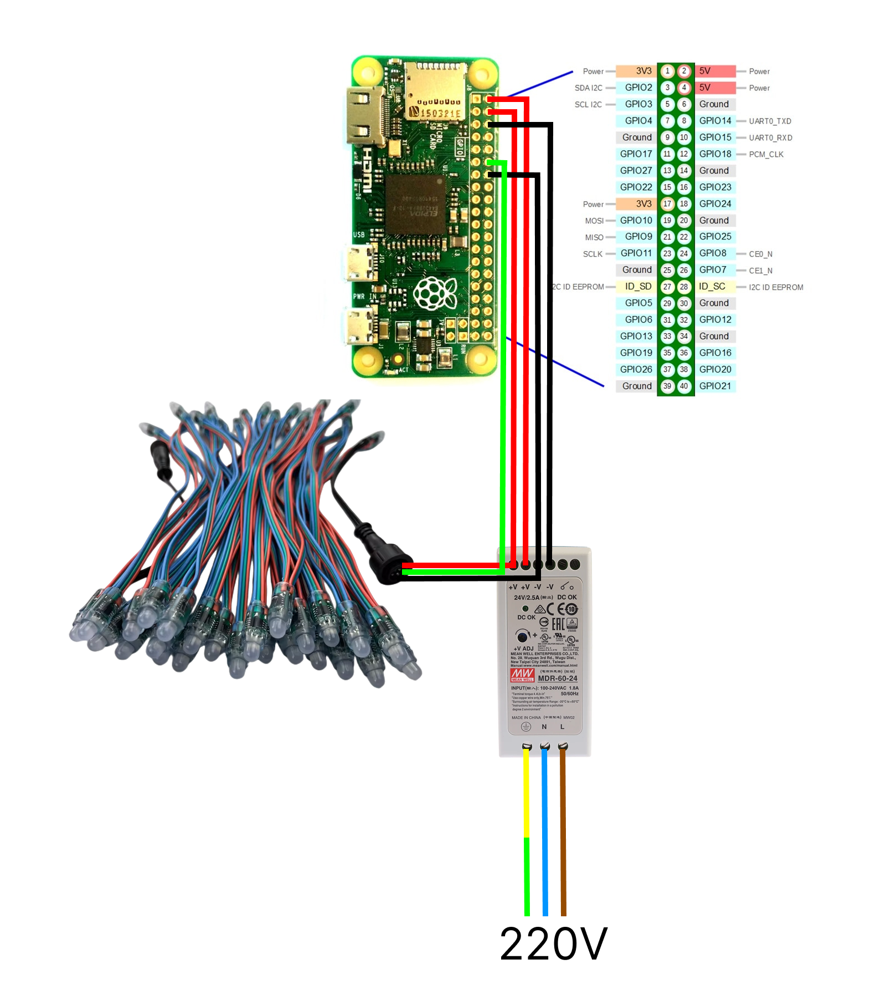

# Guida led moonboard fai da te 
## Occorrente 
- un Raspberry W Zero con almeno 8GB SD Card (consiglio il sito melopero)
- 4x LED Strips: 50x WS2811 LED, 5V, 12mm – con cavo 23cm acquistabili su aliexpress
- alimentatore supplementare meanwell mdr-60-5 - (~60mA * 50 * 4 = 12A ==> 60 W for 5V)

## Preparazione 
collegare il tutto secondo il seguente modo:

il cavo verde dovrebbe essere sempre al centro ed è quello che trasporta i dati 
mentre gli altri 2 dovete leggere cosa c'è scritto sopra al cavo 

## Configurare il Raspberry

per configurare il raspberry possiamo suddividere il tutto in diverse fasi 
- Preparazione macchina per lavorare comodi
- Preparazione ambiente per installare il software 
- Installazione servizi 
- Test

### Preparazione macchina
avviamo il rasberry collegando una tastiera e un monitor
ci sarà una guida iniziale per creare un utente 
io per praticità consiglierei di chiamare l'utente bob
in quanto il mio progetto l'ho pensato per questo utente.

* Creare l'utente bob 
* una volta avviato collegare il raspberry ad una rete wi-fi conosciuta (di casa?)
* andare in impostazioni e:
   * impostare come nome host  **`raspi-moonboard`**
   * verificare che nel file hosts ci sia  **`127.0.1.1       raspi-moonboard`** andando in `cat /etc/hosts`
   * abilitare ssh, c'è uno switch apposito
   * per ottimizzare le performance consiglio di abilitare anche lo switch per far partire il raspberry in modalità testuale (se necessario per entrare in modalità video basta digitare `startx`)
* riavvia il raspi
* ora con il proprio pc `ssh -l bob ip_del_raspberrry` (per scoprire il l'ip se hai accesso al router li ci sono i client connessi altrimenti utilizzare il comando `nmap -sn 192.168.1.0/24`)

### Preparazione ambiente
una volta preparata la macchina se siamo sulla stessa rete e ci colleghiamo via ssh potremmo tranquillamente monitorare e installare il tutto dal nostro pc.

* cloniamo il progetto git `git clone https://github.com/CallMeBoby/moonboard.git`
* digitiamo  `./moonboard/install/install/10-prepare-raspi.sh`
* riavvia il raspberry con `sudo shutdown -r now`

### installazione servizi

se i passaggi precedenti sono andati a buon fine allora 
possiamo configurare mosquitto 
digitando `sudo vi /etc/mosquitto/mosquitto.conf`:
* aperto l'editor digitare `i` per iniziare a editare
* aggiungere le seguenti righe a fondo pagina 
  * `listener 1883`
  * `allow_anonymous true`
* premere `ESC`
* digitare `:wq`

ora mosquitto e configurato e possiamo digitare  
`./moonboard/install/install/20-prepare-python.sh`

se tutto va a buon fine digitiamo 
`./moonboard/install/install/30-install-service.sh`

## Test

dovrebbe essere tutto ok ma se servono test

possiamo controllare che i servizi siano tutti su con i comandi 

- `sudo systemctl status com.moonboard.service` servizio bluetooth
- `sudo systemctl status moonboard_led.service` servizio led
- `mosquitto_sub -h raspi-moonboard -t "moonboard/ble/problem"`
- `tail -f /var/log/moonboard_ble_stderr.log` log 
- per abilitare log più dettagliati spostarsi sul branch debug